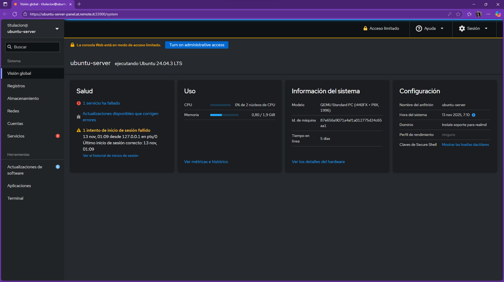
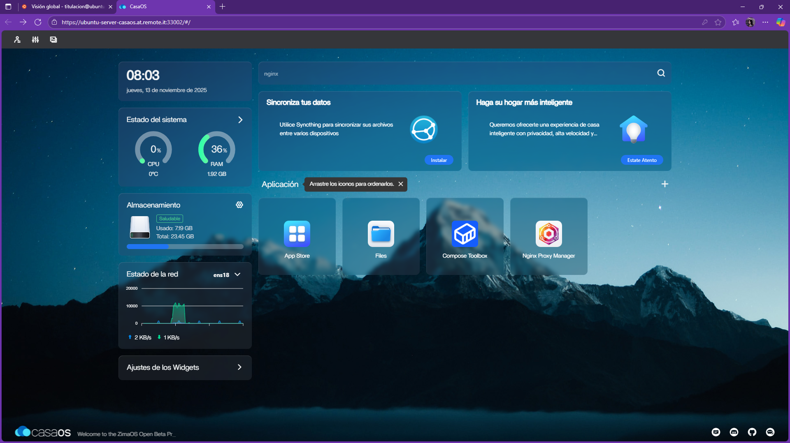
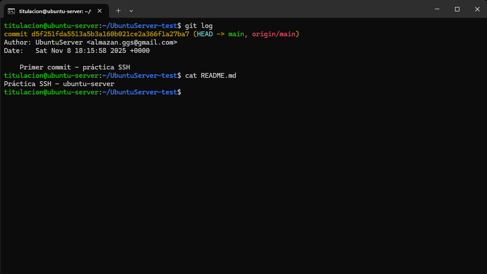

## 🌐 Datos del servidor
- **IP del servidor:** `192.168.0.107`
- **Usuario:** `titulacion`    
- **Cockpit:** [https://192.168.0.107:9090](https://192.168.0.107:9090)  
- **CasaOS:** [http://192.168.0.107](http://192.168.0.107)

---

## 📸 Evidencias
1. **Cockpit:** Captura mostrando uso de CPU/RAM, servicios y terminal. 

2. **CasaOS:** Captura de app instalada (ej. Nginx o Portainer) y docker ps.  
 
3. **SSH + GitHub:** Captura de conexión exitosa y push del repositorio. 
 

---

## 🔒 Recomendaciones de seguridad
1. Habilitar **TLS** en Cockpit para proteger el acceso web.  
2. Deshabilitar el **inicio de sesión de root por contraseña**.  
3. Mantener **UFW o firewall activo** y limitar los puertos expuestos.  

---

## 🧠 Respuestas breves

### ¿Por qué usar Cockpit en vez de solo CLI?
Cockpit ofrece una interfaz gráfica accesible desde el navegador que permite monitorear recursos, administrar servicios y revisar logs de forma visual. Es ideal para administradores nuevos o tareas rápidas, sin reemplazar la potencia de la CLI. Facilita la supervisión y reduce errores por comandos mal escritos.

---

### Riesgo principal de exponer CasaOS en Internet
CasaOS ejecuta contenedores con acceso a recursos del sistema. Si se expone sin firewall ni autenticación segura, un atacante podría acceder a los servicios o contenedores y comprometer el servidor. Por eso se recomienda mantenerlo solo en red interna o tras una VPN con TLS.

---

### Ventaja de usar ed25519 frente a RSA
Ed25519 es más seguro y eficiente: genera claves más cortas, difíciles de vulnerar y más rápidas de verificar. Ofrece la misma o mayor seguridad que RSA con menor tamaño y consumo de CPU, por lo que se considera el estándar moderno para autenticación SSH.

---

## 🧾 Autor
**Equipo 4 — Práctica SSH / Administración Linux**  
Universidad — Titulación 2025
